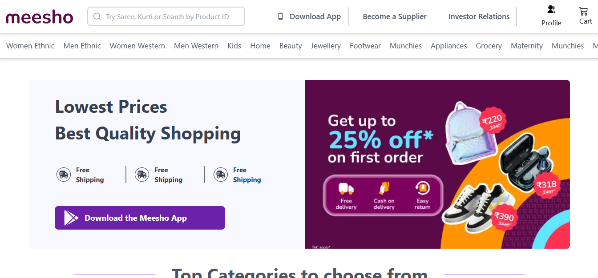

# 🛍️ Meesho Clone – E-commerce Frontend using React.js  --WORKING--

A responsive and modern **Meesho Clone** built with **React.js** and **Tailwind CSS**, showcasing an e-commerce UI similar to the Meesho shopping app. It includes a functional homepage, category section, sliders, and product listings – all designed to provide a real-world shopping experience frontend.

---

## 🚀 Features

✅ Homepage with banners and category slider  
✅ Product listing layout  
✅ Responsive design using Tailwind CSS  
✅ Modular component structure  
✅ Clean and reusable code  

---

## 📸 Screenshot

  
*(Replace with your actual screenshot)*

---

## 🔧 Tech Stack

- **React.js** – Component-based UI library  
- **Tailwind CSS** – Utility-first CSS framework  
- **JavaScript (ES6)** – Application logic  
- **HTML/CSS** – Page structure and styling

---

## 📁 Project Structure

meesho-clone/
│── public/ 
│ └── index.html
│── src/│ 
├── Components/ │ │ 
├── Navbar.jsx │ │ 
├── ProductLandingPage.jsx │ │ 
├── ProductListingPage.jsx │ 
│ └── ...other components │
├── App.js │ └── index.js └── README.md

🙌 Contribution
Feel free to fork this repo, improve the UI, or add new features like:

Add to Cart functionality

Product details page

Authentication

📜 License
This project is open-source under the MIT License.

✨ Author
Sagar Singh Rajawat
GitHub | LinkedIn

yaml
Copy
Edit

---

Let me know when you're ready with your next project, and I’ll prepare a README for that too! Or if you want 

